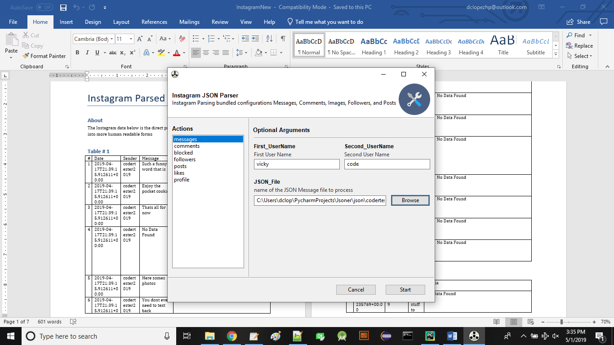

# DFS
DFS tools

# Instagram Parser

InstagramParser is a tool to parse data dumps obtained through Instagrams data request feature.
The program will parse the JSON data files provided by the user along with the one  one/both username/s. The program will then generate a word document with corresponding word tables within documenting the data found indexed and labeled in columns. The created document will be created in a folder named "output" or if cannot be created, the file will be created and stored at the same file level as the executable

## Installation

No installation needed. Simply run exe to use. NOTE* Built on Windwows 10 64 bit system.

## Usage

The program defaults to the messages feature in the left window. The list contains several functions for use. BUT, at this time, only the messaging functionallity is currently operational. The remaining functions will serve the same purpose but for their own specific category. 

## Screen Shot

